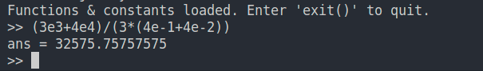
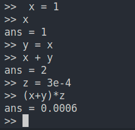

# CS205 C/C++ Project 2 Report

**Name:** 刘啸涵 Xiaohan Liu

**SID:** 11911925

**Project github link:** [https://github.com/Infas12/CS205Proj-2](https://github.com/Infas12/CS205Proj-2)

## Part 1 - Analysis

**问题**

本项目中我们要实现一个交互式的计算器。这个计算器需要支持大部分的基本功能（四则运算，带括号的运算等）。该计算器需要具有处理极大值的能力（比如大于long long的数），同时也需要能支持一些基本函数和带符号的计算。


**设计思路**

0. 指导思想
我希望这份代码读起来简单易懂。因为我是非计系的学生，所以比起速度和算法的优雅性（就算想我也整不出来），在这个项目中我更关注代码的结构。

1. 核心数学类 `IFSNumber`
我们紧接着Proj1的设计，复用上次设计的代码，实现了除乘法外的其他四则运算，以及一些基本的运算符。使用这个类时，本计算器可以支持科学计数法输入输出。同时除法外所有运算符都支持任意精度。

2. 模板类的使用
由于我们的数学类`IFSNumber`是手搓的，所以比起第三方库它又慢又吃内存。我们希望能够快速调换核心的数学组件，所以在本次的设计中我们大量地使用了模板类。比如，我们给数字类提供了一个基础的封装，`Number<T>`。表达式和函数部分同理，也都是模板类。我们要求使用的数学类都必须实现了基本的四则运算和比较符；支持用字符串构造；同时可以使用输出流`<<`输出这个数。

3. 表达式处理
我们使用的表达式的处理方式比较呆滞。我们所做的本质上是不停地替换原始的表达式字符串：首先是替换函数，其次是符号，然后是括号，最后是加减乘除。这个过程中设计到非常大量且愚蠢的字符串替换工作，事情显然不应当这样。

我本来希望用更为优雅地方法处理。在代码中，我特意让`Expression`继承自`Number`类，打算让代码可以把所有东西都当作基本数字来处理，但是最后却没有这么做成，大部分的运算工作最后还是塞在表达式的部分里了。我真的缺乏足够的时间（和算法素养）。

4. 函数处理
为了简化问题，我们只设计了如何处理单变量的函数。我们设计了一个`FunctionManager<T>`单例类来处理这些函数。注册时需提供函数名和对应的函数指针。在处理表达式时会先遍历一下map，如果式子里有函数名就找出对应指针来处理。

5. 符号处理
和函数一样，我们设计了一个`VariableManager<T>`单例类来符号。本质上符号类只是在把两个字符串等价了起来，并在处理表达式时进行替换。

## Part 2 - Code

此处我们会展示一小部分的关键代码。

**主函数**
```c++
int main(int argc, char *argv[]) {

    std::cout << "CS205 Proj#2 by Xiaohan Liu." << std::endl;

    //Register constants here
    VariableManager<IFSNumber>::Instance()->registerVariable("PI","3.1415926");

    //Register functions here
    FunctionManager<IFSNumber>::Instance()->registerFunction("abs",abs<IFSNumber>);
    FunctionManager<IFSNumber>::Instance()->registerFunction("getNeg",getNeg<IFSNumber>);
    FunctionManager<IFSNumber>::Instance()->registerFunction("sqrt",IFSsqrt<IFSNumber>);

    std::cout << "Functions & constants loaded. Enter 'exit()' to quit." << std::endl;

    std::string input;
    std::cout << ">> ";
    std::getline(std::cin,input);
    try{
        while(input != "exit()"){
            removeSpaces(input);    
            if(input.find('=')==std::string::npos){ //is expression
                Expression<IFSNumber> result(input);
                std::cout << "ans = " << result.getValue() << std::endl; //store answer as a variable
                VariableManager<IFSNumber>::Instance()->registerVariable("ans",result.getValue().toString());
            }else{ //is assignment
                VariableManager<IFSNumber>::Instance()->HandleAssignment(input);
            }
            std::cout << ">> ";
            std::getline(std::cin,input);
        }
    }catch(std::exception e){
        std::cout << "An error occured, please check your input." << std::endl;
    }

}
```

代码的工作流程如上图所示：我们首先会注册预先内置的变量和函数；随后引导用户进行输入。如果输入含有等号即是赋值，反之则是运算。在输入`exit()`后则会直接退出。

**IFSNumber类加减法**
和上次一样，我们的`IFSNumber`类使用类似于科学计数法的方式来储存。数字部分储存在一个数组中；随后有一个m_exponent用来表示这个数的小数点需要移动多少位。加法时我们会需要对其这两个数字的位数，操作如下：

```c++
int _buf_c1[MAX_SIZE] = {0};
int _buf_c2[MAX_SIZE] = {0};
int _exponential = 0;

if(c1.m_exponent<=c2.m_exponent){
    memcpy(_buf_c2 + c2.m_exponent - c1.m_exponent ,c2.m_numbers, c2.m_length * sizeof(int));
    memcpy(_buf_c1, c1.m_numbers, c1.m_length * sizeof(int));
    _exponential = c1.m_exponent;
}else{
    memcpy(_buf_c1 + c1.m_exponent - c2.m_exponent ,c1.m_numbers, c1.m_length * sizeof(int));
    memcpy(_buf_c2, c2.m_numbers, c2.m_length * sizeof(int));
    _exponential = c2.m_exponent;
}
```
在移位之后，我们会再将两个buffer中的数字逐位相加/相减。

**函数处理**
```c++
void replaceFunction(){
    FunctionManager<T>* _manager = FunctionManager<T>::Instance();
    for(auto iter = _manager->m_functionTable.begin();iter != _manager->m_functionTable.end(); iter++){
        std::string _funcName = iter->first;
        int _funcBeginIdx = m_expr.find(_funcName);
        if(_funcBeginIdx==std::string::npos) continue; //do not evalueate the functions that do not exist
        
        //get function param
        int _funcEndIdx = _funcBeginIdx + _funcName.length() - 1;
        int bracketCnt = 0;
        int bracketBeginIdx = _funcEndIdx + 1;
        int bracketEndIdx = -1;
        for(int i = bracketBeginIdx; i < m_expr.length(); i++){
            char _c = m_expr.at(i);
            if(_c=='(') bracketCnt++;
            if(_c==')') bracketCnt--;
            bracketEndIdx = i;
            if(bracketCnt==0) break;
        }

        std::string sub_expr = m_expr.substr(bracketBeginIdx+1,bracketEndIdx-bracketBeginIdx-1);
        
        Number<T> (*func)(Number<T>) = iter->second;
        Number<T> result = func(Expression<T>(sub_expr));
        T value = result.getValue();
        std::string result_str = value.toString();
        std::string var = m_expr.substr(_funcBeginIdx,bracketEndIdx-_funcBeginIdx+1);

        m_expr.replace(_funcBeginIdx,bracketEndIdx-_funcBeginIdx+1,result_str);

    }            
}
```
函数处理如此图所示：首先我们会便利一下function map中的内容，挨个判断本表达式中是否存在这个函数。如果有，就去把这个函数括号中的表达式算出来，作为参数喂给函数，令其计算。在计算完成后，整个替换字符串中表达式+括号内容的部分。

值得留意的是函数指针这边我们吃了不少苦头。我们有几个用到的函数是const函数，但编译器似乎无法知道这个带模板的函数指针会不会修改不该修改的东西，导致一些东西必须拆成数行来写。

**用户自定义函数**
用户可以自定义一些简单的函数，比如说：

```c++
template <class T>
Number<T> abs(Number<T> operand){
    return operand < -operand ? -operand : operand;
}
```

然后注册即可：

```c++
FunctionManager<IFSNumber>::Instance()->registerFunction("abs",abs<IFSNumber>);
```

复杂的，涉及数值运算的函数则会依赖于数值类，不能通过调Number的接口来计算，否则会很容易导致爆栈。这个实现是邪恶的，应当被唾弃的（它要求sqrt函数已经被正确重载），但我没办法只能这么干了。

```c++
template <class T>
Number<T> IFSsqrt(Number<T> operand){
    return sqrt(operand); 
} //evil implementation
```

同样的，注册一下即可之后直接调用。

```c++
FunctionManager<IFSNumber>::Instance()->registerFunction("sqrt",IFSsqrt<IFSNumber>);
```
## Part 3 - Result & Verification

### 基础四则运算

  

### 任意精度加减法和乘法

  

### 含括号四则运算

  

### 赋值和符号

  

### 调用函数

  

### 混合使用例

  

## Part 4 - Difficulties & Solutions

**1. 除法，以及其他数值计算**
除法和sqrt函数需要一定的数值计算技巧，实现起来较为困难。在本项目中，我们在实现上进行了一定的妥协：sqrt和除法是不支持任意精度的。在除法中，我们是将除数转换为了`long long`，再逐位相除，实现了这一功能。同样的，在sqrt函数中，我们将被开方数转换为了double格式进行开方。

**2. 方便快捷的自定义函数以及变量处理**
我们希望回避指针和全局变量满天飞的状况，因此使用了单例设计模式来对函数和变量进行管理。

```c++
template <class T>
class FunctionManager{

public:

    typedef Number<T> (*FUNC)(Number<T>); //for now we only support single-parameter function

    std::map<std::string, FUNC> m_functionTable;

    static FunctionManager* Instance(){
        static FunctionManager<T> instance;
        return &instance;
    }

    void registerFunction(std::string name, FUNC handler){
        m_functionTable.insert(std::make_pair(name,handler));
    }

private:
    FunctionManager(){};    

};
```

**3. 函数绑定**
为了避免写太多if-else来处理函数，我们使用了函数指针。我们可以通过函数名快速查找对应的操作，然后进行调用。
```c++
std::string sub_expr = m_expr.substr(bracketBeginIdx+1,bracketEndIdx-bracketBeginIdx-1);

Number<T> (*func)(Number<T>) = iter->second;
Number<T> result = func(Expression<T>(sub_expr));
T value = result.getValue();
std::string result_str = value.toString();
std::string var = m_expr.substr(_funcBeginIdx,bracketEndIdx-_funcBeginIdx+1);

m_expr.replace(_funcBeginIdx,bracketEndIdx-_funcBeginIdx+1,result_str);
```

**4. 表达式处理**

表达式处理过程中，我们按照优先级排列，先算函数和符号，再算括号，最后算运算符。如果遇到子括号就先算出这个子表达式。这个操作非常简单粗暴但确实还是工作的。

